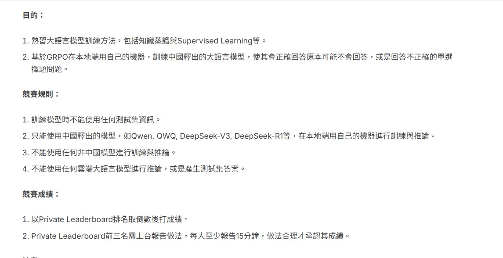

# GRPO-LLM
GRPO (Generalized Rejection Prediction Objective)，它是一種針對語言模型訓練的 指令拒答訓練目標函數（拒絕不合適輸出），透過訓練一個中國開原LLM，來回答一些原本拒步回答的題目。

## Author：國立陽明交通大學 資訊管理與財務金融學系財務金融所碩一 313707043 翁智宏



## 🎯 任務目標

本專案目的是透過 **GRPO** 技術，在本地端微調開源中文語言模型（如 Qwen2.5-3B），使模型學會根據輸入選擇題回答正確選項，或在無法判斷時拒絕給出錯誤答案。

> 📌 此任務禁止使用非中國釋出的模型或任何雲端推論資源，並以 Local 訓練與本地推理為主。

---

## 🧰 使用技術與模型

| 元件        | 描述 |
|-------------|------|
| 🌐 Model     | `Qwen/Qwen2.5-3B-Instruct`（中國釋出） |
| 🧩 Fine-tune | 使用 `LoRA` 微調技術，結合 `GRPOTrainer` |
| 🧠 Reward    | 自定義 reward function，根據 `<reasoning>` 長度與 `<answer>` 是否正確給分 |
| 📄 Dataset   | 題目、選項與正確答案組成的 `.csv` 格式（train/test） |

---

## 🧠 方法概述

- **模型來源**：Qwen/Qwen2.5-3B-Instruct，使用 Hugging Face 模型倉庫下載。
- **訓練資料格式**：
  - 欄位：題目、選項A~D、推理正確答案、正確答案
  - 輸入 prompt 範例：
    ```
    請閱讀以下選擇題，並輸出解題步驟與正確答案（使用指定格式）：
    問題內容...
    A. 選項A內容
    B. 選項B內容
    C. 選項C內容
    D. 選項D內容
    請依照以下格式輸出：
    <reasoning>...</reasoning>
    <answer>...</answer>
    ```
  - 輸出 output 範例（target）：
    ```
    <reasoning>
    解題步驟說明...
    </reasoning>
    <answer>
    B
    </answer>
    ```

---

## 🛠 環境安裝

本專案需要以下 Python 套件與硬體資源：

```bash
pip install unsloth vllm bitsandbytes peft transformers datasets trl accelerate einops
pip install --upgrade transformers accelerate bitsandbytes
